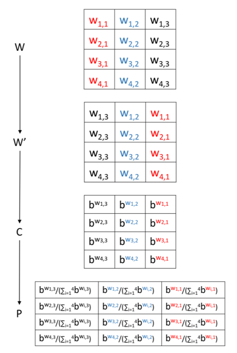

# Overview: kernel-to-PWM transformation

Convolutional neural networks use kernels to extract informative motifs from massive amount of sequence datasets. However, the only way to distill the motifs from these kernels is a heuristic one from Deepbind (Alipanahi et al., 2015) that aligns all matched sequence segments altogether and calculate the frequency directly, leading to one Position Weight Matrix (PWM) for each kernel.

Here we discovered an exact transformation from kernel to PWM, in the sense that the convolution result of the kernel on a given sequence fragment is __identical__ to the sum of a sequence-independent constant and the log-likelihood of the PWM on the same sequence.

Steps of this exact transformation are detailed below:



# How to use this tool

The tool is available from the `k2p-1.0` directory. It depends on the python packages numpy, pandas, and keras. Below is a copy of `README` in this archive:

## Summary

The python scripts in this toolbox allow the user to transform a
kernel that is applied directly to nucleotide sequences into a PWM, or
vice versa. Specifically,

- `./code/kernel2PWM.py` : transform a kernel into a PWM with a given
  base. The resulting PWM is in meme motif format.

- `./code/PWM2kernel.py` : transform a PWM into a kernel with a given
  base. The PWM must be in meme motif format.

- `./code/kernel2PWM_MLE.py` : transform a series of kernels into PWMs
  with the base estimated by Maximum Likelihood Estimation (MLE),
  which requires the user to provide sequences from which the kernels
  have been trained. These kernels are assumed to come from a model
  with the following structure: input -> convolution -> linear or ReLU
  activation -> global max-pooling -> arbitrary layers. The kernels,
  sequences, and PWMs are all stored as hdf5 tensors.


The following datasets are for testing purposes, and they also
illustrates how the input should be formatted. For the details of
input formats, please refer to the help message of each script (use
"-h" to show the help message).

- `./data/toy_kernel_matrix.txt` : a toy example of the kernel file
  describing the kernel matrix.

- `./data/toy_PWM.meme` : a toy example of the PWM file describing the
  PWM matrix.

- `./data/toy_PWM_2_with_zero.meme` : another toy example of the PWM
  file. This PWM contains a zero element, which will be detected and
  corrected by `./code/PWM2kernel.py`.

- `./data/for.3..1.kernel.tensor.hdf5` and
  `./data/for.3..1.sequence.tensor.hdf5` : a toy example of the kernel
  and sequence tensors.

## Prerequisites 

- Python 2.7 and the following packages:
    - numpy
    - h5py (for ./code/kernel2PWM_MLE.py only)
    - scipy (for ./code/kernel2PWM_MLE.py only)

## Example usages

Run the following commands under the root directory (where the "code"
and "data" directories are):

```
$ python ./code/kernel2PWM.py ./data/toy_kernel_matrix.txt ./data/toy_kernel_transformed_PWM.meme

$ python ./code/PWM2kernel.py ./data/toy_PWM.meme ./data/toy_PWM_transformed_kernel.txt

$ python ./code/PWM2kernel.py ./data/toy_PWM_2_with_zero.meme ./data/toy_PWM_2_with_zero_transformed_kernel.txt

$ python ./code/kernel2PWM_MLE.py ./data/for.3..1.kernel.tensor.hdf5 ./data/for.3..1.sequence.tensor.hdf5 ./data/for.3..1.PWM.tensor.hdf5
```

# Cite this work

Please cite the following bioRxiv prepint ( [https://dx.doi.org/10.1101/163220](https://dx.doi.org/10.1101/163220) ):

```
Ding,Y. et al. (2018) An exact transformation for CNN kernel enables accurate sequence motif identification and leads to a potentially full probabilistic interpretation of CNN. bioRxiv, 163220.
```

This will be updated once the work is accepted by a particular journal or conference.

# Reproduce results of this work in the manuscript above

The following directories in `supplements` are for reproducing the corresponding figures in the manuscript:

- Wilcoxon signed test results: standard output of `work03` (see `work03_simulate.simple.case.3/README.md` for more details).
- Figure 3 : `work05_retrain.Deepbind.model/data/for.2..3.MAPE.and.MSE.comparison.result.for.all.motifs.png` (see ``work05_retrain.Deepbind.model/README.md` for more details).
- Validation accuracies for the AddGene case: see `work06_compare.k2p.and.Deepbind.heuristic.for.complex.models/README.md` for more details.

Codes and guidelines (described by `README.md` )for reproducing these figures are also available in the corresponding `work*` directories.

# Other directories in `supplements`

- `text01_supplementary.information`: this directory contains the PDF file for the Supplementary Notes.
- `tool02_k2p`: this directory contains several python scripts used by `work*` directories above.
